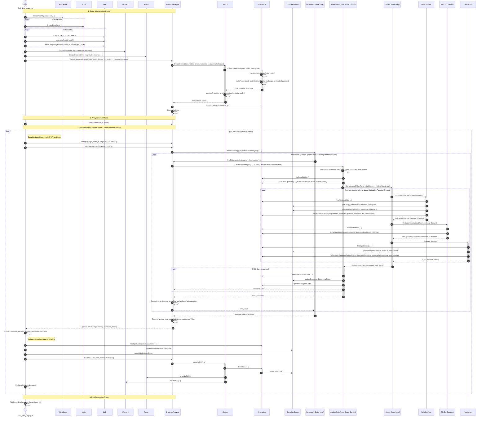

```mermaid
sequenceDiagram
    autonumber
    actor Script as Ex6_New_Legacy.m
    participant WS as WorkSpace
    participant N as Node
    participant L as Link
    participant M as Moment
    participant F as Force
    participant DA as DistanceAnalysis
    participant Stat as Statics
    participant Kin as Kinematics
    participant Beam as CompliantBeam
    participant fMinSearch as fminsearch (Outer Loop)
    participant LA_Inner as LoadAnalysis (Inner Solver Context)
    participant fMinCon as fmincon (Inner Loop)
    participant fMConFunc as fMinConFunc
    participant fMConConstr as fMinConCostraint
    participant HessFnc as hessianfcn

    Note over Script,DA: 1. Setup & Initialization Phase
    Script->>WS: Create WorkSpace(10, 10, ...)
    
    loop Setup Nodes
        Script->>N: Create Node(id, x, y)
    end
    
    loop Setup Links
        Script->>L: Create Link(id, [node1, node2])
        Script->>L: setJoints([joint1, joint2])
        Script->>L: makeCompliant(thickness, width, E, BeamType.CBCM)
    end
    
    Script->>M: Create Moment(id, link, magnitude, distance)
    Script->>F: Create Force(id, link, magnitude, distance, ...)
    
    Script->>DA: Create DistanceAnalysis(links, nodes, forces, moments, ..., currentWorkspace)
    activate DA
    DA->>Stat: Create Statics(links, nodes, forces, moments, ..., currentWorkspace)
    activate Stat
    Stat->>Kin: Create Kinematics(links, nodes, workspace)
    activate Kin
    Kin->>Kin: constructLinksNodes(links, nodes)
    Kin->>Kin: mainPreparation() (getAdjacencyMatrix, findLoops, kinematicEquations)
    Kin-->>Stat: Initial kinematic structure
    deactivate Kin
    Stat->>Stat: prepare() (update force/moment paths, initial angles)
    Stat-->>DA: Initial Statics object
    deactivate Stat
    DA->>Kin: findInputMatrix(initialGuess, [])
    DA->>DA: Store initialState
    deactivate DA
    
    Note over Script,DA: 2. Analysis Setup Phase
    Script->>DA: selectLoad(force_id, 'force')
    
    Note over Script,DA: 3. Simulation Loop (Displacement Control / Inverse Statics)
    loop For each step (1 to numSteps)
        Note right of Script: Calculate targetDisp = x_displ * i / numSteps
        Script->>DA: addInput(target_node_id, targetDisp, 'x', allLinks)
        
        Script->>DA: simulationNoGUI(currentWorkspace)
        activate DA
        DA->>fMinSearch: Call fminsearch(@(x) findDistanceAnalysis(x, ...))
        activate fMinSearch
        
        loop fminsearch iterations (Outer Loop: Guessing Load Magnitude)
            fMinSearch->>DA: findDistanceAnalysis(current_load_guess, ...)
            activate DA
            DA->>LA_Inner: Create LoadAnalysis(..., DA.static) (for this fminsearch iteration)
            activate LA_Inner
            LA_Inner->>LA_Inner: Update force/moment magnitude based on current_load_guess
            LA_Inner->>Kin: findInputMatrix(...)
            LA_Inner->>Kin: solveStaticEquations(...) (for initial distances of non-follower forces)
            
            LA_Inner->>fMinCon: Call fmincon(fMConFunc, initialGuess, ..., fMConConstr, opt)
            activate fMinCon
            
            loop fmincon iterations (Inner Loop: Minimizing Potential Energy)
                fMinCon->>fMConFunc: Evaluate Objective (Potential Energy)
                activate fMConFunc
                fMConFunc->>Kin: findInputMatrix(x, ...)
                fMConFunc->>Beam: getEnergy(outputMatrix, indexList, workspace)
                fMConFunc->>Beam: getGradient(outputMatrix, indexList, workspace)
                fMConFunc->>Kin: solveStaticEquations(outputMatrix, kinematicEquations, indexList) (for external work)
                fMConFunc-->>fMinCon: fval, gval (Potential Energy & Gradient)
                deactivate fMConFunc
                
                fMinCon->>fMConConstr: Evaluate Constraints (Kinematic Loop Closure)
                activate fMConConstr
                fMConConstr->>Kin: findInputMatrix(x, ...)
                fMConConstr->>Kin: solveStaticEquations(outputMatrix, kinematicEquations, indexList)
                fMConConstr-->>fMinCon: ceq, gradceq (Constraint Violations & Jacobian)
                deactivate fMConConstr
                
                fMinCon->>HessFnc: Evaluate Hessian
                activate HessFnc
                HessFnc->>Kin: findInputMatrix(x, ...)
                HessFnc->>Beam: getHessian(outputMatrix, indexList, workspace)
                HessFnc->>Kin: solveStaticEquations(outputMatrix, kinematicEquations, indexList) (for external force hessian)
                HessFnc-->>fMinCon: H_out (Hessian Matrix)
                deactivate HessFnc
            end
            fMinCon-->>LA_Inner: newState, exitflag (Equilibrium State Vector)
            deactivate fMinCon
            
            alt if fMinCon converged
                LA_Inner->>Kin: findInputMatrix(newState, ...)
                LA_Inner->>Beam: updateBeam(newState, newState)
                LA_Inner->>Kin: updateNodes(newState)
                LA_Inner-->>DA: updatedNodes
            else
                LA_Inner-->>DA: Failure indicator
            end
            deactivate LA_Inner
            
            DA->>DA: Calculate error between targetDisp and updatedNodes position
            DA-->>fMinSearch: error_value
            deactivate DA
        end
        fMinSearch-->>DA: converged_load_magnitude
        deactivate fMinSearch
        
        DA->>DA: Store converged_load_magnitude in newValues.newValue
        DA-->>Script: Updated DA object (containing computed_forces)
        deactivate DA
        
        Script->>Script: Extract computed_forces = analysis.newValues.newValue
        
        Note right of Script: Update mechanism state for drawing
        Script->>Kin: findInputMatrix(solver.x_current, ...)
        Script->>Beam: updateBeam(newState, newState)
        Script->>Kin: updateNodes(newState)
        
        Script->>DA: drawNoGUI(cla, limit, currentWorkspace)
        activate DA
        DA->>Stat: drawNoGUI(...)
        activate Stat
        Stat->>Kin: drawNoGUI(...)
        activate Kin
        Kin->>Beam: drawLinkNoGUI(...)
        deactivate Kin
        Stat->>F: drawNoGUI(...)
        Stat->>M: drawNoGUI(...)
        deactivate Stat
        deactivate DA
        Script->>Script: Update plot title & drawnow
    end
    
    Note over Script,DA: 4. Post-Processing Phase
    Script->>Script: Plot Force-Displacement Curve (figure 99)

```
