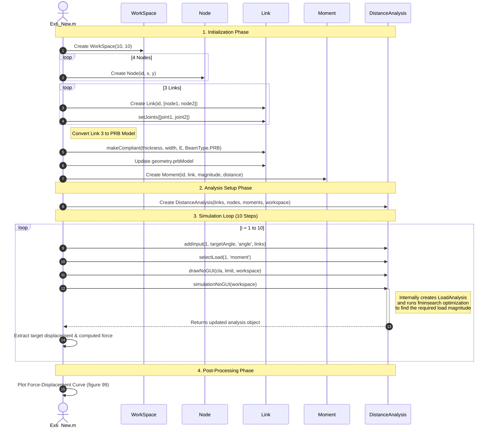

```mermaid
sequenceDiagram
    autonumber
    actor Script as Ex6_New.m
    participant WS as WorkSpace
    participant N as Node
    participant L as Link
    participant M as Moment
    participant DA as DistanceAnalysis
    
    Note over Script,DA: 1. Initialization Phase
    Script->>WS: Create WorkSpace(10, 10)
    
    loop 4 Nodes
        Script->>N: Create Node(id, x, y)
    end
    
    loop 3 Links
        Script->>L: Create Link(id, [node1, node2])
        Script->>L: setJoints([joint1, joint2])
    end
    
    Note right of Script: Convert Link 3 to PRB Model
    Script->>L: makeCompliant(thickness, width, E, BeamType.PRB)
    Script->>L: Update geometry.prbModel
    
    Script->>M: Create Moment(id, link, magnitude, distance)
    
    Note over Script,DA: 2. Analysis Setup Phase
    Script->>DA: Create DistanceAnalysis(links, nodes, moments, workspace)
    
    Note over Script,DA: 3. Simulation Loop (10 Steps)
    loop i = 1 to 10
        Script->>DA: addInput(1, targetAngle, 'angle', links)
        Script->>DA: selectLoad(1, 'moment')
        Script->>DA: drawNoGUI(cla, limit, workspace)
        
        Script->>DA: simulationNoGUI(workspace)
        activate DA
        Note right of DA: Internally creates LoadAnalysis<br/>and runs fminsearch optimization<br/>to find the required load magnitude
        DA-->>Script: Returns updated analysis object
        deactivate DA
        
        Script->>Script: Extract target displacement & computed force
    end
    
    Note over Script,DA: 4. Post-Processing Phase
    Script->>Script: Plot Force-Displacement Curve (figure 99)
```
