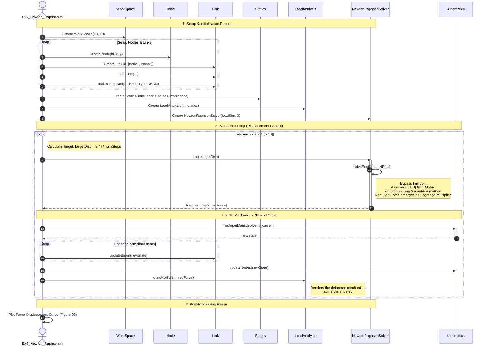

```mermaid
sequenceDiagram
    autonumber
    actor Script as Ex6_Newton_Raphson.m
    participant WS as WorkSpace
    participant N as Node
    participant L as Link
    participant Stat as Statics
    participant LA as LoadAnalysis
    participant NRS as NewtonRaphsonSolver
    participant Kin as Kinematics

    Note over Script,NRS: 1. Setup & Initialization Phase
    Script->>WS: Create WorkSpace(10, 10)
    
    loop Setup Nodes & Links
        Script->>N: Create Node(id, x, y)
        Script->>L: Create Link(id, [node1, node2])
        Script->>L: setJoints(...)
        Script->>L: makeCompliant(..., BeamType.CBCM)
    end
    
    Script->>Stat: Create Statics(links, nodes, forces, workspace)
    Script->>LA: Create LoadAnalysis(..., statics)
    Script->>NRS: Create NewtonRaphsonSolver(loadSim, 0)
    
    Note over Script,Kin: 2. Simulation Loop (Displacement Control)
    loop For each step (1 to 10)
        Note right of Script: Calculate Target: targetDisp = 2 * i / numSteps
        
        Script->>NRS: step(targetDisp)
        activate NRS
        NRS->>NRS: solveEquilibriumNR(...)
        Note right of NRS: Bypass fmincon.<br/>Assemble [H, J] KKT Matrix.<br/>Find roots using Secant/NR method.<br/>Required Force emerges as Lagrange Multiplier.
        NRS-->>Script: Returns [dispX, reqForce]
        deactivate NRS
        
        Note over Script,Kin: Update Mechanism Physical State
        Script->>Kin: findInputMatrix(solver.x_current)
        activate Kin
        Kin-->>Script: newState
        deactivate Kin
        
        loop For each compliant beam
            Script->>L: updateBeam(newState)
        end
        
        Script->>Kin: updateNodes(newState)
        
        Script->>LA: drawNoGUI(..., reqForce)
        Note right of LA: Renders the deformed mechanism<br/>at the current step
    end
    
    Note over Script,NRS: 3. Post-Processing Phase
    Script->>Script: Plot Force-Displacement Curve (Figure 99)
```