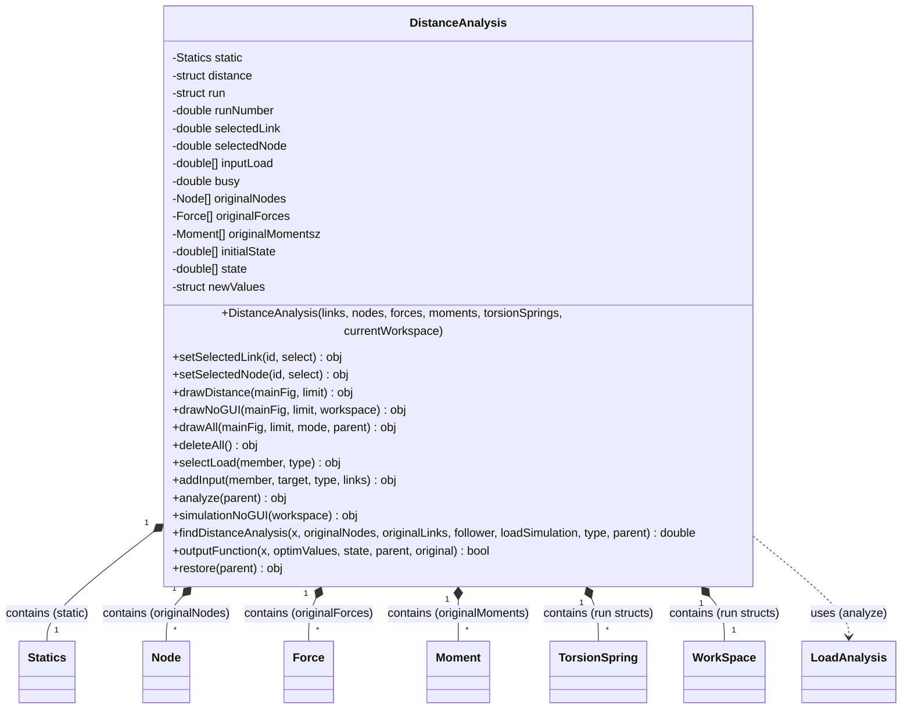

```mermaid
classDiagram
    class DistanceAnalysis {
        -Statics static
        -struct distance
        -struct run
        -double runNumber
        -double selectedLink
        -double selectedNode
        -double[] inputLoad
        -double busy
        -Node[] originalNodes
        -Force[] originalForces
        -Moment[] originalMomentsz
        -double[] initialState
        -double[] state
        -struct newValues
        
        +DistanceAnalysis(links, nodes, forces, moments, torsionSprings, currentWorkspace)
        +setSelectedLink(id, select) obj
        +setSelectedNode(id, select) obj
        +drawDistance(mainFig, limit) obj
        +drawNoGUI(mainFig, limit, workspace) obj
        +drawAll(mainFig, limit, mode, parent) obj
        +deleteAll() obj
        +selectLoad(member, type) obj
        +addInput(member, target, type, links) obj
        +analyze(parent) obj
        +simulationNoGUI(workspace) obj
        +findDistanceAnalysis(x, originalNodes, originalLinks, follower, loadSimulation, type, parent) double
        +outputFunction(x, optimValues, state, parent, original) bool
        +restore(parent) obj
    }

    %% Related Classes (Simplified)
    class Statics
    class Node
    class Force
    class Moment
    class TorsionSpring
    class WorkSpace
    class LoadAnalysis

    %% Relationships
    DistanceAnalysis "1" *-- "1" Statics : contains (static)
    DistanceAnalysis "1" *-- "*" Node : contains (originalNodes)
    DistanceAnalysis "1" *-- "*" Force : contains (originalForces)
    DistanceAnalysis "1" *-- "*" Moment : contains (originalMoments)
    DistanceAnalysis "1" *-- "*" TorsionSpring : contains (run structs)
    DistanceAnalysis "1" *-- "1" WorkSpace : contains (run structs)
    DistanceAnalysis ..> LoadAnalysis : uses (analyze)
```    
