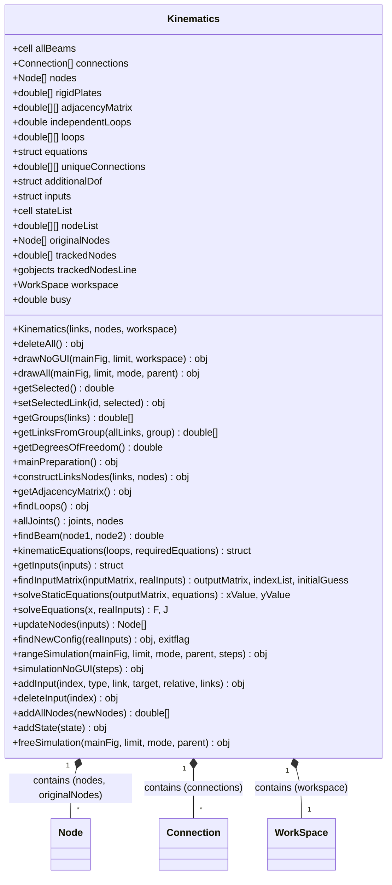

```mermaid

classDiagram

    class Kinematics {

        +cell allBeams

        +Connection[] connections

        +Node[] nodes

        +double[] rigidPlates

        +double[][] adjacencyMatrix

        +double independentLoops

        +double[][] loops

        +struct equations

        +double[][] uniqueConnections

        +struct additionalDof

        +struct inputs

        +cell stateList

        +double[][] nodeList

        +Node[] originalNodes

        +double[] trackedNodes

        +gobjects trackedNodesLine

        +WorkSpace workspace

        +double busy

        +Kinematics(links, nodes, workspace)

        +deleteAll() obj

        +drawNoGUI(mainFig, limit, workspace) obj

        +drawAll(mainFig, limit, mode, parent) obj

        +getSelected() double

        +setSelectedLink(id, selected) obj

        +getGroups(links) double[]

        +getLinksFromGroup(allLinks, group) double[]

        +getDegreesOfFreedom() double

        +mainPreparation() obj

        +constructLinksNodes(links, nodes) obj

        +getAdjacencyMatrix() obj

        +findLoops() obj

        +allJoints() joints, nodes

        +findBeam(node1, node2) double

        +kinematicEquations(loops, requiredEquations) struct

        +getInputs(inputs) struct

        +findInputMatrix(inputMatrix, realInputs) outputMatrix, indexList, initialGuess

        +solveStaticEquations(outputMatrix, equations) xValue, yValue

        +solveEquations(x, realInputs) F, J

        +updateNodes(inputs) Node[]

        +findNewConfig(realInputs) obj, exitflag

        +rangeSimulation(mainFig, limit, mode, parent, steps) obj

        +simulationNoGUI(steps) obj

        +addInput(index, type, link, target, relative, links) obj

        +deleteInput(index) obj

        +addAllNodes(newNodes) double[]

        +addState(state) obj

        +freeSimulation(mainFig, limit, mode, parent) obj

    }

  

    %% Related Classes (Simplified)

    class Node

    class Connection

    class WorkSpace

  

    %% Relationships

    Kinematics "1" *-- "*" Node : contains (nodes, originalNodes)

    Kinematics "1" *-- "*" Connection : contains (connections)

    Kinematics "1" *-- "1" WorkSpace : contains (workspace)

  

    %% Clickable Links for Obsidian

    click Node href "obsidian://open?file=0_Diagram%2FStatic_Class%2FNode"

    click Connection href "obsidian://open?file=0_Diagram%2FKinematics_Class%2FConnection"

    click WorkSpace href "obsidian://open?file=0_Diagram%2FStatic_Class%2FWorkSpace"

```